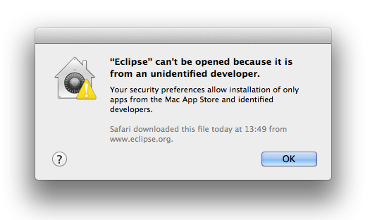

# eclipse-signer

Eclipse JEE code signer utility for Mac OS X.

## The problem



## The solution
Code-sign Eclipse with `eclipse-signer`.

## Requirements
- Mac OS X 10.9.2
- Eclipse 4.3 JEE Kepler
- Apple Developer Program Membership for __certificates and private key added to KeyChain__:
  - [Apple Inc. Root Certificate](http://www.apple.com/appleca/AppleIncRootCertificate.cer)
  - [Apple Developer ID CA](http://www.apple.com/certificateauthority/DeveloperIDCA.cer)
  - Developer Certificate issued with Developer Program Membership (*.cer)
  - Private Key used for certificate (*.p12)

## Installation
`git clone https://github.com/TeamFDT/eclipse-signer.git`

## Usage
1. Add all Apple certificates (3) and private key (1) to KeyChain
2. Download Eclipse JEE from https://www.eclipse.org/downloads/
3. Unpack the downloaded Eclipse
4. Run `eclipse-signer` from cloned Git repository on Eclipse.app:
`./eclipse-signer ~/Downloads/Eclipse.app`

In case of a successful signing process, the log should look similar to the following:
```none
Your Apple Developer ID: Interactive Pioneers GmbH (ADA489329S)
/Users/max/Downloads/eclipse/Eclipse.app/Contents/MacOS/eclipse.ini: signed generic [eclipse]
/Users/max/Downloads/eclipse/Eclipse.app/Contents/MacOS/eclipse: signed bundle with Mach-O thin (x86_64) [org.eclipse.eclipse]
/Users/max/Downloads/eclipse/Eclipse.app/Contents/MacOS/launcher: signed Mach-O thin (x86_64) [launcher]
/Users/max/Downloads/eclipse/Eclipse.app: signed bundle with Mach-O thin (x86_64) [org.eclipse.platform.ide]
Eclipse signed successfully!
```
